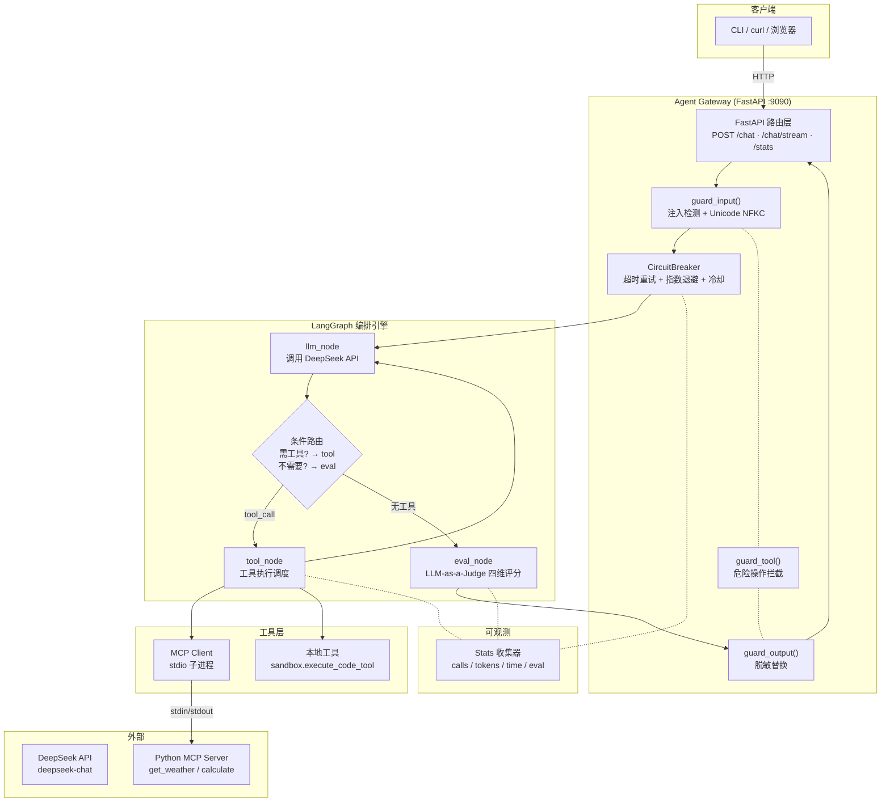
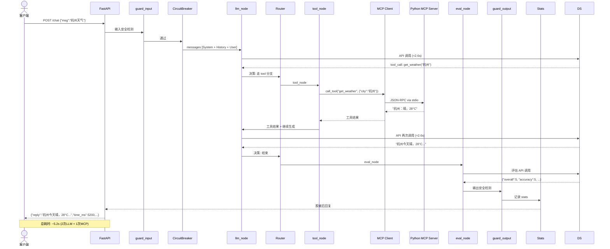
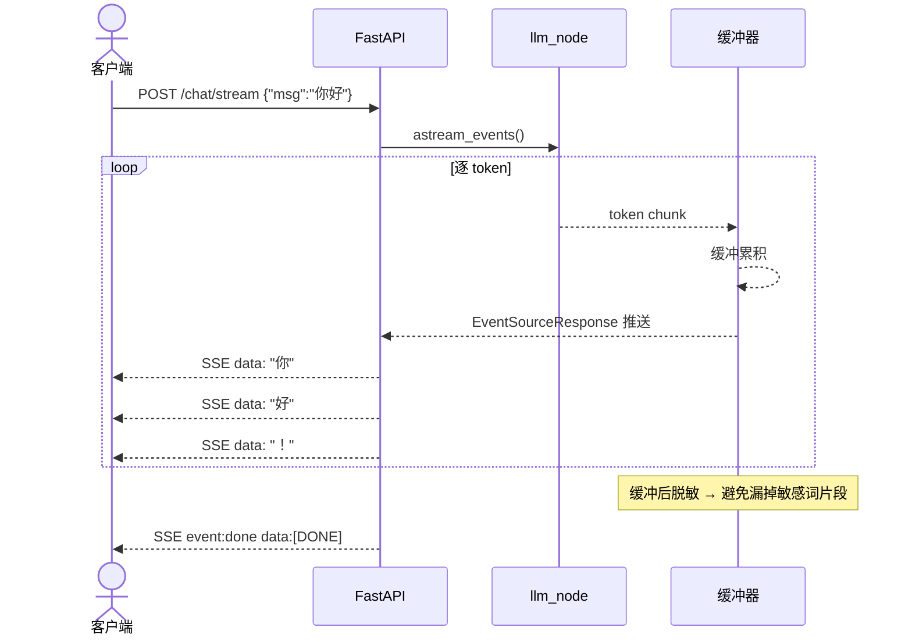
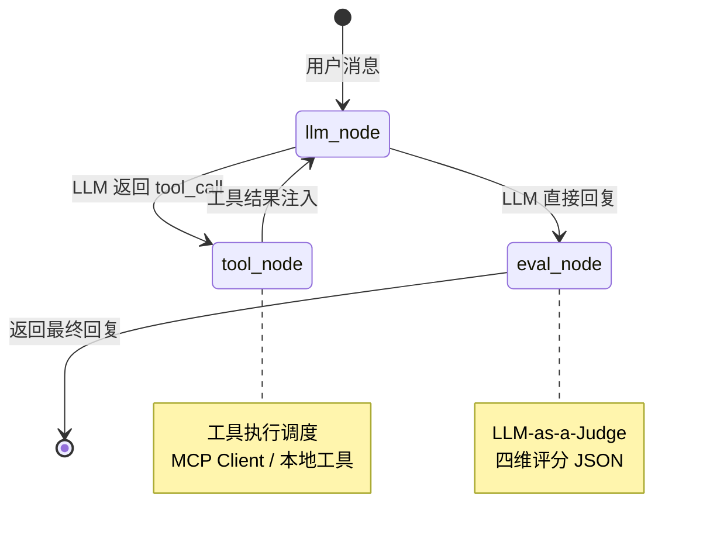
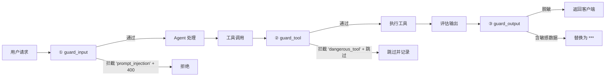

# Agent Gateway 架构设计

> 项目A：基于 LangGraph + MCP + FastAPI 的多工具 Agent 网关

## 一、系统架构

## 二、核心链路时序图

### POST /chat 同步调用

### POST /chat/stream SSE 流式

## 三、LangGraph 状态流转

## 四、安全三层防线

| 防线 | 位置 | 检测内容 | 失败策略 |
|------|------|---------|---------|
| guard_input | 请求入口 | 黑名单关键词(ignore/forget/system)、Unicode NFKC 归一化 | 返回 400 |
| guard_tool | 工具执行前 | 危险操作(os.system/subprocess/sql injection) | 跳过工具，记录日志 |
| guard_output | 响应出口 | 脱敏(PEM密钥/API Key/手机号/身份证) | 替换为 `***` |

## 五、关键设计决策

| 决策 | 理由 | 面试可讲 |
|------|------|---------|
| **LangGraph 而非手写 if-else** | State 自动合并、节点隔离、内建 Checkpoint | "类似 Flowable 工作流引擎" |
| **MCP 协议而非硬编码工具** | 跨语言、动态发现、工具与 Agent 解耦 | "类似 Java SPI 机制" |
| **LLM-as-a-Judge 而非规则评分** | 灵活理解语义，4 维度可解释 | "外部验证 > 自我评估" |
| **SSE 缓冲后脱敏** | 避免流式输出中敏感词片段漏过 | "安全在传输层和业务层都要做" |
| **单 worker 启动** | Agent 瓶颈在 LLM API 不在 CPU | "压测数据支撑：框架 P99 17ms vs LLM P99 3s" |

## 六、Java 对照实现

同一架构在 `agent-gateway-java/` 有 Spring Boot + LangChain4j 版本，相同的核心模式用 Java 表述：

| Python | Java | 模式 |
|--------|------|------|
| `@tool` 装饰器 | `@Tool` 注解 | 工具声明式注册 |
| `model.bind_tools()` | `AiServices.builder().tools()` | 工具绑定 |
| `StdioServerParameters` | `StdioMcpTransport.builder()` | MCP stdio 传输 |
| `ClientSession.list_tools()` | `McpClient` → `McpToolProvider` | MCP 动态发现 |
| `StateGraph` | — (Java 侧未接入 LangGraph4j) | 图编排 |
