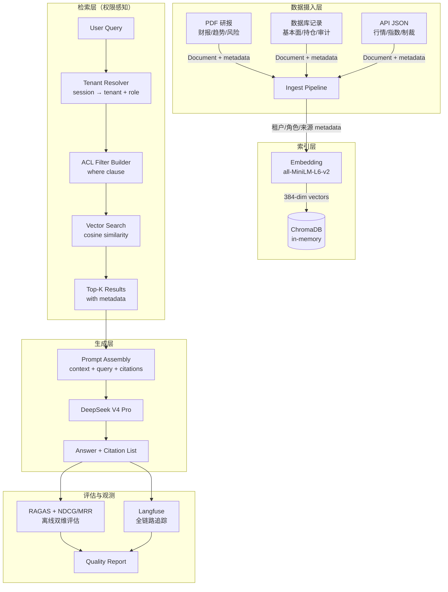
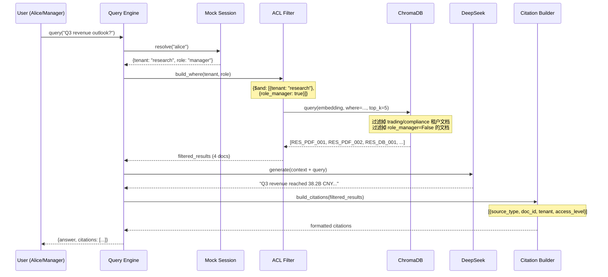
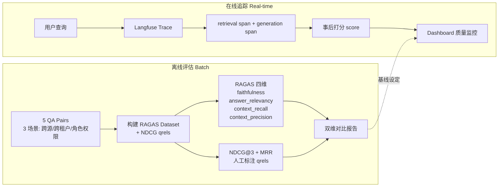
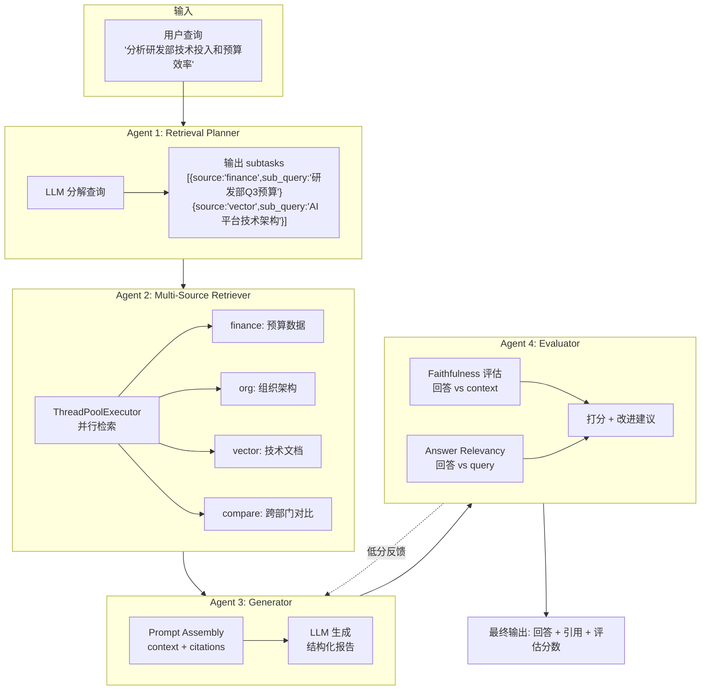

# Smart Report Agent — 系统架构文档

## 系统架构总览



## 权限检索时序图



## 评估体系图



## 数据模型

所有文档携带统一 metadata schema（ChromaDB 要求标量类型）：

| 字段 | 类型 | 说明 | 示例 |
|------|------|------|------|
| tenant | str | 租户标识 | "research" / "trading" / "compliance" |
| access_level | str | 访问级别 | "public" / "confidential" |
| role_intern | bool | intern 可读 | True / False |
| role_engineer | bool | engineer 可读 | True / False |
| role_manager | bool | manager 可读 | True / False |
| source_type | str | 数据来源 | "pdf_report" / "db_record" / "api_json" |
| doc_id | str | 文档唯一 ID | "RES_PDF_001" |
| timestamp | str | ISO 时间戳 | "2026-06-25T10:00:00" |

## 权限矩阵

| 角色 | public 文档 | confidential (本租户, non-manager-only) | confidential (manager-only) | 跨租户文档 |
|------|-----------|--------------------------------------|---------------------------|----------|
| intern | 可读 | 不可读 | 不可读 | 不可见 |
| engineer | 可读 | 可读 | 不可读 | 不可见 |
| manager | 可读 | 可读 | 可读 | 不可见 |

**关键设计**：租户隔离通过 `where={"tenant": "research"}` 在 ChromaDB 层面实现，角色过滤通过 `role_XXX=True` 布尔字段实现。即使 LLM 被 prompt 注入攻击，也无法读取跨租户文档——因为文档根本没进入 context。

## 12 篇文档分布

| doc_id | tenant | source | access | visible to |
|--------|--------|--------|--------|-----------|
| RES_PDF_001 | research | pdf_report | public | all |
| RES_PDF_002 | research | pdf_report | public | all |
| RES_DB_001 | research | db_record | public | all |
| RES_PDF_003 | research | pdf_report | confidential | engineer, manager |
| TRD_PDF_001 | trading | pdf_report | public | all |
| TRD_API_001 | trading | api_json | public | all |
| TRD_DB_001 | trading | db_record | confidential | engineer, manager |
| TRD_API_002 | trading | api_json | confidential | manager only |
| CMP_PDF_001 | compliance | pdf_report | public | all |
| CMP_DB_001 | compliance | db_record | public | all |
| CMP_API_001 | compliance | api_json | public | all |
| CMP_PDF_002 | compliance | pdf_report | confidential | manager only |

---

## 四Agent协同架构（Week 4: Agentic Retrieval）



## 静态 RAG vs Agentic Retrieval 对比 (P@K / MRR / NDCG)

```
Query                                            静态RAG                  Agentic
                                      P@3   MRR   NDCG          P@3   MRR   NDCG
--------------------------------------------------------------------------------------
平均                            0.54  1.00  1.00     0.54  1.00  1.00
```

> 小规模数据(4源/8 QA)下两者持平。Agentic 真实优势在大规模(20+源)场景中才能量化 —— 静态规则覆盖面不足，Agentic 动态路由的优势显现。

## 性能压测数据 (load_test.py)

| Agent阶段 | 平均耗时 | 占比 |
|----------|---------|------|
| Planner (LLM) | 1125ms | 17% |
| Retriever (并行) | 0ms | 0% |
| **Generator (LLM) → 瓶颈** | **4322ms** | **65%** |
| Evaluator (LLM) | 1241ms | 18% |
| **端到端总计** | **6688ms** | 100% |

| 指标 | 静态RAG | Agentic (1并发) |
|------|---------|----------------|
| QPS | 25000+ | 0.1 |
| 成本/次 | ¥0 | ¥0.003 |
| 月成本(100次/天×22天) | ¥0 | ¥6.60 |

> 优化方向: Generator 引入 Streaming (SSE) 可提升用户感知速度; 简单查询用静态RAG兜底

## 故障注入测试结果 (fault_injection.py)

| 测试项 | 注入方式 | 系统行为 | 结果 |
|--------|---------|---------|------|
| Tool 超时 | 非法 base_url → 连接拒绝 | APIConnectionError 正确抛出 | PASS |
| LLM 幻觉 | 虚假 Retrieval context (50万 vs 实920万) | Evaluator faithfulness=1.0, 防线在Retrieval层 | PASS |
| 上下文截断 | 超长 context (1818字) | Generator 正常生成, 128K窗口足够 | PASS |
| Planner输出异常 | 非法 subtasks 结构 | 防御性处理 + fail-fast | PASS |

## 项目文件地图

```
smart-report-agent/
├── ARCHITECTURE.md          ← 本文件: 架构文档
├── README.md                ← 业务+技术栈+运行指南
├── ingest.py                ← 数据摄入 (PDF/DB/API → ChromaDB)
├── agentic_retrieval.py     ← Agentic Retrieval (Planner → Retriever 动态路由)
├── four_agent_system.py     ← 四Agent协同核心 (Planner/Retriever/Generator/Evaluator)
├── multi_agent_collab.py    ← 多Agent协作模式 (Manager-Worker/流水线)
├── query_engine.py          ← 权限感知查询 (ACL Filter + LLM生成)
├── retrieval_compare.py     ← 检索质量对比 (P@K/MRR/NDCG, 静态 vs Agentic)
├── load_test.py             ← 负载压测 (QPS/P99/成本, 阶段耗时拆解)
├── fault_injection.py       ← 故障注入 (超时/幻觉/截断/格式异常)
├── evaluate.py              ← 离线评估 (RAGAS 四维)
└── trace_pipeline.py        ← Langfuse 全链路追踪
```
