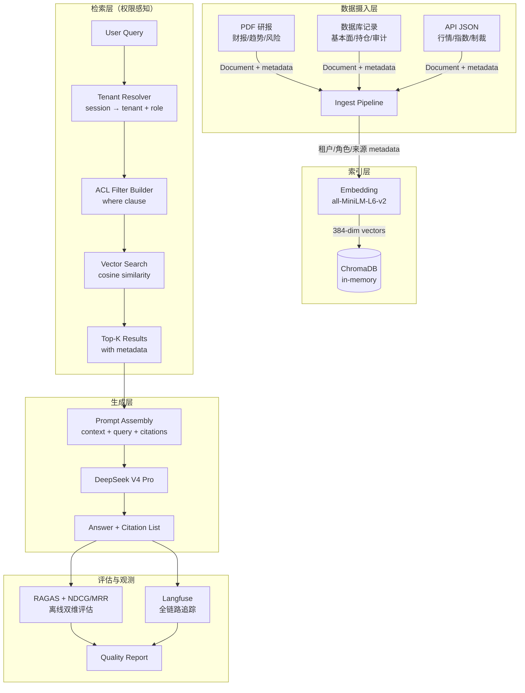
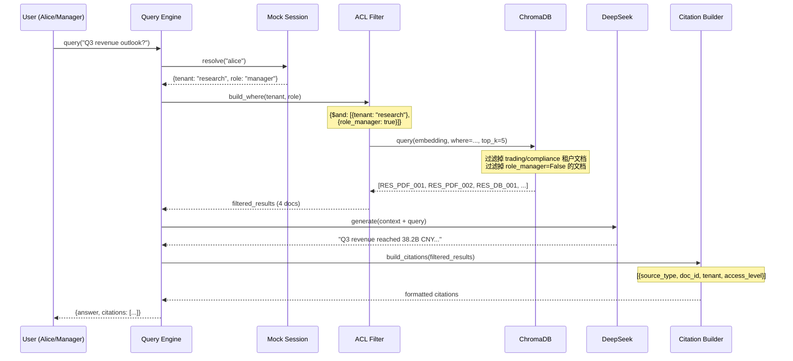
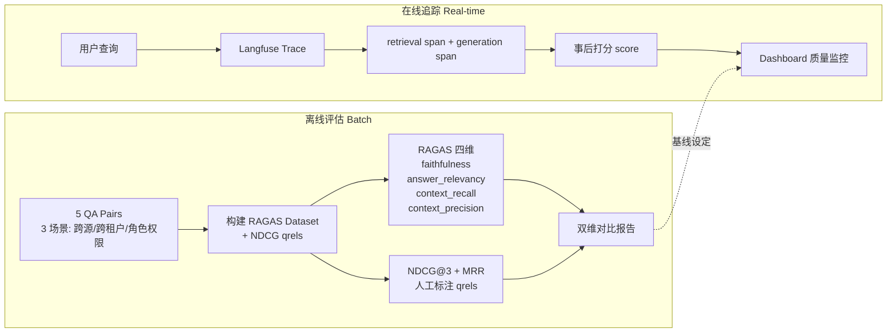

# Smart Report Agent — 系统架构文档

## 系统架构总览

## 权限检索时序图

## 评估体系图

## 数据模型

所有文档携带统一 metadata schema（ChromaDB 要求标量类型）：

| 字段 | 类型 | 说明 | 示例 |
|------|------|------|------|
| tenant | str | 租户标识 | "research" / "trading" / "compliance" |
| access_level | str | 访问级别 | "public" / "confidential" |
| role_intern | bool | intern 可读 | True / False |
| role_engineer | bool | engineer 可读 | True / False |
| role_manager | bool | manager 可读 | True / False |
| source_type | str | 数据来源 | "pdf_report" / "db_record" / "api_json" |
| doc_id | str | 文档唯一 ID | "RES_PDF_001" |
| timestamp | str | ISO 时间戳 | "2026-06-25T10:00:00" |

## 权限矩阵

| 角色 | public 文档 | confidential (本租户, non-manager-only) | confidential (manager-only) | 跨租户文档 |
|------|-----------|--------------------------------------|---------------------------|----------|
| intern | 可读 | 不可读 | 不可读 | 不可见 |
| engineer | 可读 | 可读 | 不可读 | 不可见 |
| manager | 可读 | 可读 | 可读 | 不可见 |

**关键设计**：租户隔离通过 `where={"tenant": "research"}` 在 ChromaDB 层面实现，角色过滤通过 `role_XXX=True` 布尔字段实现。即使 LLM 被 prompt 注入攻击，也无法读取跨租户文档——因为文档根本没进入 context。

## 12 篇文档分布

| doc_id | tenant | source | access | visible to |
|--------|--------|--------|--------|-----------|
| RES_PDF_001 | research | pdf_report | public | all |
| RES_PDF_002 | research | pdf_report | public | all |
| RES_DB_001 | research | db_record | public | all |
| RES_PDF_003 | research | pdf_report | confidential | engineer, manager |
| TRD_PDF_001 | trading | pdf_report | public | all |
| TRD_API_001 | trading | api_json | public | all |
| TRD_DB_001 | trading | db_record | confidential | engineer, manager |
| TRD_API_002 | trading | api_json | confidential | manager only |
| CMP_PDF_001 | compliance | pdf_report | public | all |
| CMP_DB_001 | compliance | db_record | public | all |
| CMP_API_001 | compliance | api_json | public | all |
| CMP_PDF_002 | compliance | pdf_report | confidential | manager only |
